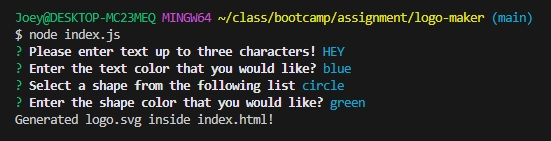

# logo-maker

## Description

This logo maker allows you to create a logo by asking the user four questions, and taking then making the logo with the user input!

The four questions that the user is asked are

1.'Please enter text up to three characters!'
2. 'Enter the text color that you would like?'
3. 'Select a shape from the following list'
4. 'Enter the shape color that you would like?'

With this the logo is generated in an index.html and you are able to see your logo. There is also a node.test.js file in here that tests the node.js, so you can test user inputs to see if it passes the tests necessary!

https://drive.google.com/file/d/12i7Mc2d8xMg2WZ4f3Sj3TLZT3SCQbP1K/view

## Installation

You can go to either the repo and download it https://github.com/Rockojoe2/logo-maker 

## Credits

UTA Class repo folder

https://www.w3schools.com/graphics/svg_examples.asp for SVG examples

## License

MIT License

---

